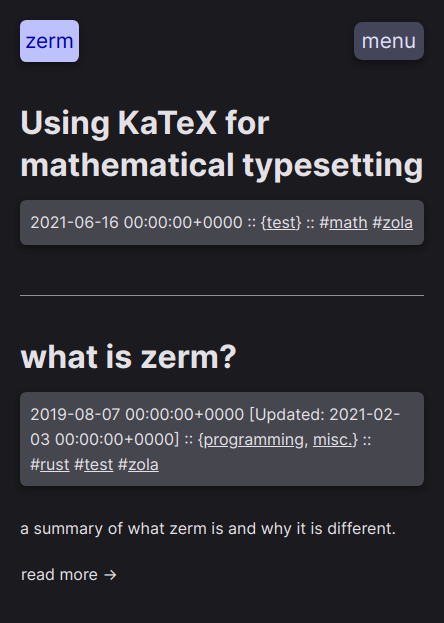

# merm

A soft material-like light and dark theme based on [ejmg's zerm theme](https://github.com/ejmg/zerm) for [Zola](https://getzola.org).



[Web preview](https://annaaurora.eu/)

## Differences

ejmg's theme
	- only uses a monospace font instead of sans-serif and monospace.
	- has no rounded corners.
	- has only dark themes.
	- has not got Material Design colors.
	- doesn't display the Favicon in the top left.
	- doesn't display hours, minutes, seconds and timezone in timestamps

## Configuration

Please follow the Zola documentation for [how to use a
theme](https://www.getzola.org/documentation/themes/installing-and-using-themes/#installing-a-theme).

In `config.toml`, you will find all values for customization that are supported
thus far have documentation explaining how they are used. If there is any confusion or something is not working as intended, [please open an issue](https://codeberg.org/annaaurora/merm/issues)!

## Math

You can use KaTeX for mathematical typesetting.
Assets are only available if you opt-in on a per-page level through
a single line (`math=true`) on the extra section of the page frontmatter.

``` md
# index.md
+++
title="this page title"
...

[extra]
math=true
+++

Content
```

Pages wich doesn't opt-in are not affected in any way, so you doesn't have
to worry about any performance hit.

## License

MIT. See `LICENSE.md` for more details.
